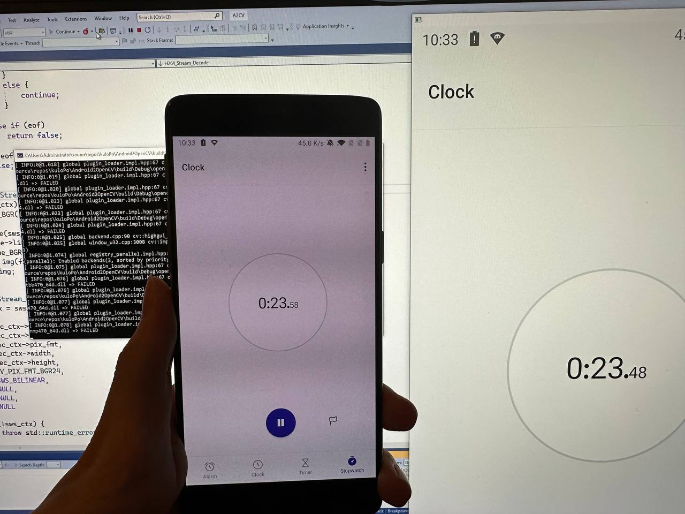

# Android2OpenCV
Stream Android screen to OpenCV.

## Implementation Details
This project uses "adb screenrecord" to generate h264 stream, and pipe to FFMPEG for decoding. 

## Run

### Windows
1. Download `adb` and make sure it is in the system `PATH`
2. Make sure the device shows up using `adb devices`
3. Download this program from [release](https://github.com/kuloPo/Android2OpenCV/releases) and run `A2CV.exe`

### Linux
Only tested on Ubuntu 22.04 Desktop
```
sudo apt install libopencv-dev adb
chmod +x ./A2CV_Linux
./A2CV_Linux
```
## Demo

